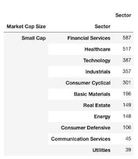

# EDA on Publicly Traded Stocks (2014-2018)
**Tools used**: \ 
Python, Pandas, SeaBorn, Sci-Kit Learn, Yahoo Finance API

**Datasets used**: \
Indicators: https://www.kaggle.com/cnic92/200-financial-indicators-of-us-stocks-20142018 \
Tickers: http://eoddata.com/symbols.aspx

The purpose of this project is to complete exploratory data analysis on publicly traded stocks in the U.S. and see what insights can be drawn from our datasource. The dataset is quite comprehensive with *226 columns* worth of financial indicators for each of the 4000+ stocks. All of these indicators come from the companies' yearly 10-K's and cover expenditures, revenues, equity, and relevant ratios. The comapanies listed here come from the three major U.S. exchanges (the NYSE, NASDAQ, and AMEX) and are labeled by  economic sector, i.e Technology, Real Estate, etc.

After creating a high level overview of the market, we should look to highlight some of the best and worst performing stocks and create a mock portfolio whose performance we can track and simulate.

**Some tasks to be accomplished:**

* Trim features down to more managable amount. Focus on selecting the indicators that we find most interesting
* Break down dataset into sectors. Find sectors of the market are most profitable, those which spend the most on R&D, etc
* Obtain a view of small, vs. mid, vs. large-cap firms and assess their market performance comparitively

## DATA ENGINEERING

Our original dataset only has Ticker values for each security. To improve the readability, I've brought in a column that has the name of the company associated with each ticker. This can be accomplished using the separate dataframe from EOD Data and performing an INNER join on the Ticker symbol. There is a large amount of missing data in our dataset. Every row has at least one column with missing information.

## MARKET SECTOR BREAKDOWN

We can see that the largest portion of stocks traded were those of finance, healthcare, and tech. Very few of the stocks listed were those of communications and utility companies.

We also see that the majority of stocks traded are those of small-cap firms.

Within the overall cap sizes, we can also create a view to see the proportion of sector representation within these cap sizes. Tech dominates across mid and large caps, while a significantly large proportion of small cap stocks come from healthcare firms.

## CORRELATION ANALYSIS

A colored heatmap allows us to quickly get a visual sense of some of the existing relationships between our features. It is important to see how they interact with each other to gain an understanding of each. Large swaths of the diagram are black meaning some variables are completely uncorrelated with each other.

## THOUGHTS ON MACHINE LEARNING

There is a column in our dataset *PRICE VAR [%]* that tells us how the adjusted closing price for the stock shifted for the following year. We can set this to be our target variable *Y* for machine learning purposes. Due to the large amount of features we have to choose from, a neural network may perform well here to learn which features can predict *Y* best. Of course, regression models can work as well, but the data is not linear and the features are highly collinear so more robust methods would be required (Random Forest, Polynomial functions, etc).

We also have a variable *Class* that has a value of 0 or 1 for each record. 1 represents "Buy" and is assigned to stocks who had a positive price variance from the previous year. Those stocks with negative price gains are assigned a 0 and can be thought of as "Don't Buy/Sell". This simple binary classification method means we can train a logistic model and see if we can classify a stock in this way.

## MARKOWITZ PORTFOLIO OPTIMIZATION

The Markowitz model provides us an intuitive framework with which we can analyze stock portfolios. The theory is that through the minimization of risk or internal correlation of a portfolio, one can find an efficient combination of stocks that mitigates volatility and optimizes returns. Markowitz developed the idea of an *efficient frontier* meaning that for a portfolio of stocks with a given volatility, there exists one that can potentially issue higher returns for the same amount of risk. Using the Yahoo Finance API, we can find the historical returns over a given time period for a few selected stocks from our dataset.

If we simulate a diverse portfolio composed of a general representation of the whole market, we can see the efficient frontier take shape. Higher volatility portfolios will yield higher returns. Consequently, higher returns are possible for the same amount of risk depending on the weighting of the portfolio. Each point we hover over shows us a unique portfolio with a different weighting of each stock.

When we simulate a portfolio with only tech stocks, we can see that we achieve substantially higher returns at the cost of substantially higher risk. Our efficient frontier is much more dramatic when he have fewer stocks to choose from. 