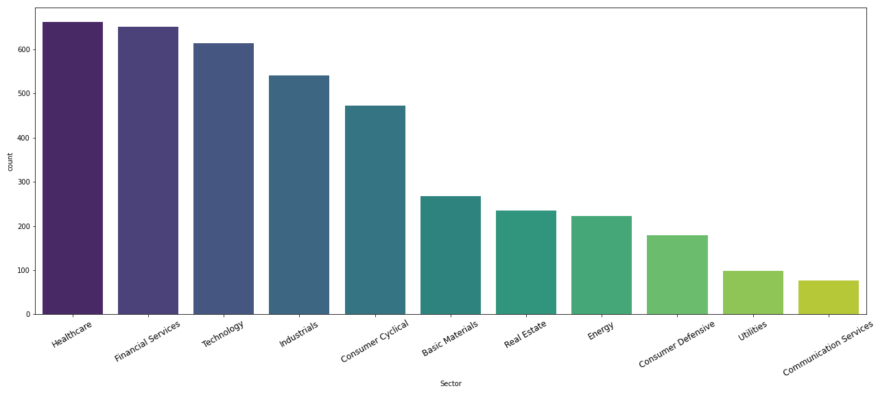

# EDA on Publicly Traded Stocks (2014-2018)
Datasets used: \
Indicators: https://www.kaggle.com/cnic92/200-financial-indicators-of-us-stocks-20142018 \
Tickers: http://eoddata.com/symbols.aspx

The purpose of this project is to complete exploratory data analysis on publicly traded stocks in the U.S. and see what insights can be drawn from our datasource. The dataset is quite comprehensive with *226 columns* worth of financial indicators for each stock. All of these indicators come from the companies' yearly 10-K's and cover expenditures, revenues, equity, and relevant ratios.

**Some tasks to be accomplished:**

* Trim features down to more managable amount. Focus on selecting the indicators that we find most interesting
* Break down dataset into sectors. Find sectors of the market are most profitable, those which spend the most on R&D, etc
* Obtain a view of small, vs. mid, vs. large-cap firms and assess their market performance comparitively
* Obtain a high-level view of select ETF performance

## Transformations

Our original dataset only has Ticker values for each security. To improve the readability, I've brought in a column that has the name of the company associated with each ticker. This can be accomplished using the separate dataframe from EOD Data and performing an INNER join on the Ticker symbol.

## High Level Snapshot

\
\
\

## Market Sector Breakdown
